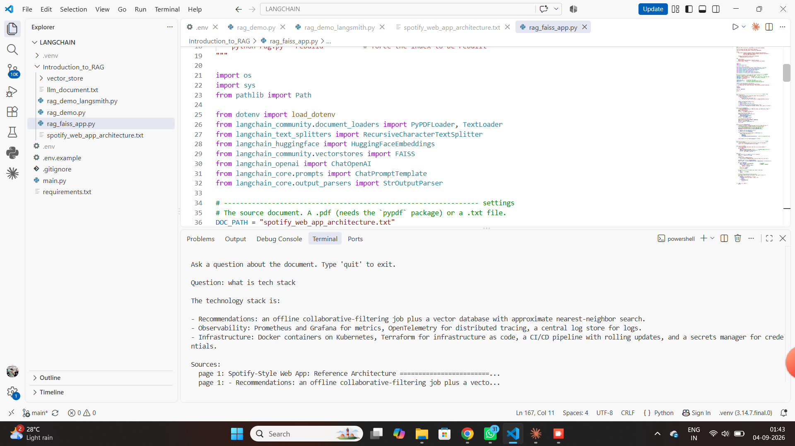

# 04 · RAG with FAISS + LangSmith

A five-stage RAG pipeline in one script — load → split → embed → index in **FAISS** → retrieve & answer — with every step traced in **LangSmith**.

📄 [Walkthrough (PDF)](rag-demo-with-langsmith.pdf) · ▶ [Watch the demo](https://github.com/Hariharan17194/ai-engineering-lab/releases/download/demos/rag-faiss-demo.mp4)
