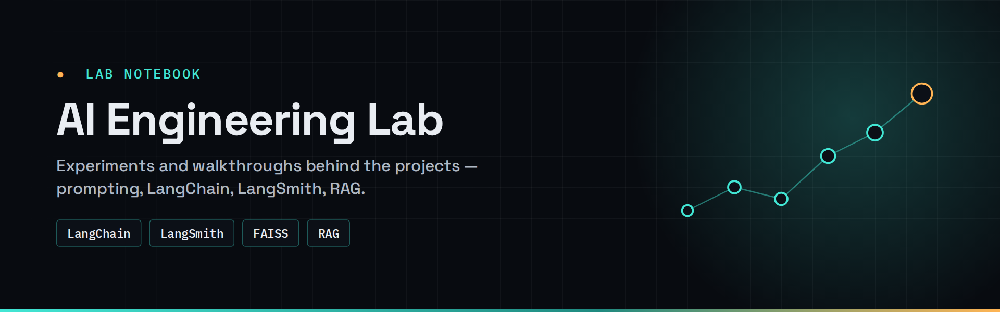

# 🧪 AI Engineering Lab

**Experiments, walkthroughs and demos from my applied-AI learning path — prompting, LangChain, LangSmith and RAG.**

The polished, production-style projects live in their own repos — see my [profile](https://github.com/Hariharan17194). This repo is the lab notebook behind them.

| # | Experiment | What's inside | Stack |
|---|---|---|---|
| 01 | [GenAI basics](01-genai-basics) | First end-to-end generative AI app | Python · LLM API |
| 02 | [Prompt → video](02-prompt-to-video) | Text-to-video generation from a crafted prompt | Prompt engineering |
| 03 | [LangChain + LangSmith](03-langchain-langsmith) | Building a chain step by step and tracing it | LangChain · LangSmith |
| 04 | [RAG with FAISS](04-rag-faiss-demo) | Five-stage RAG pipeline, traced in LangSmith | LangChain · FAISS |
| 05 | [RAG chatbot](05-rag-chatbot) | Chat UI over a document knowledge base | RAG · Streamlit |
| 06 | [Meal planner](06-meal-planner) | Structured, constraint-driven generation with an LLM | Prompt engineering |

**Where this led →** [hybrid-graph-rag](https://github.com/Hariharan17194/hybrid-graph-rag) · [autogen-support-desk](https://github.com/Hariharan17194/autogen-support-desk) · [crewai-support-agent](https://github.com/Hariharan17194/crewai-support-agent) · [n8n-ai-agents](https://github.com/Hariharan17194/n8n-ai-agents)
